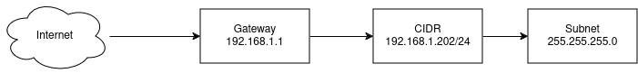
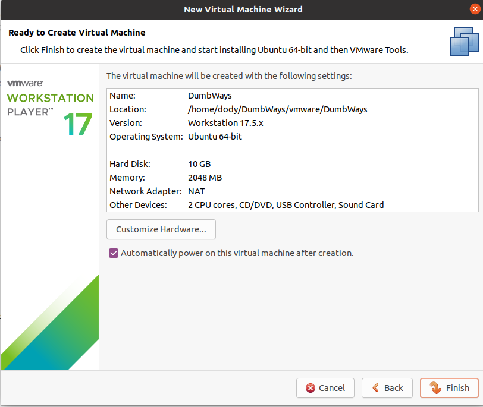
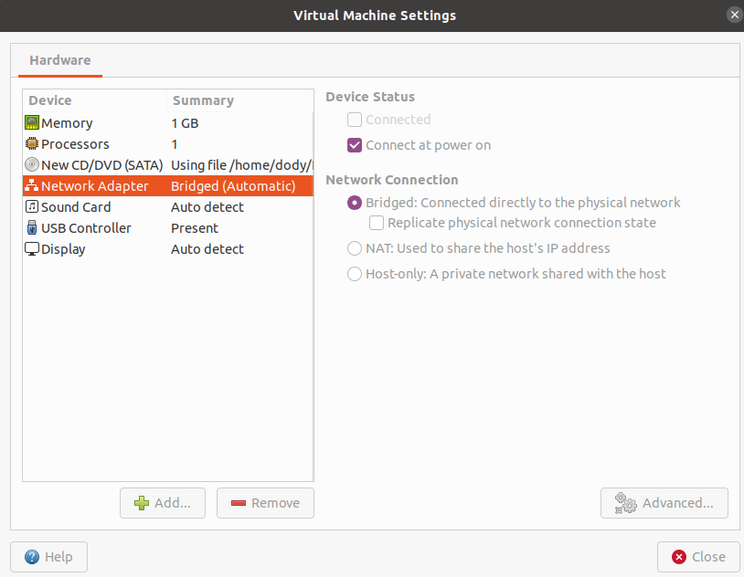
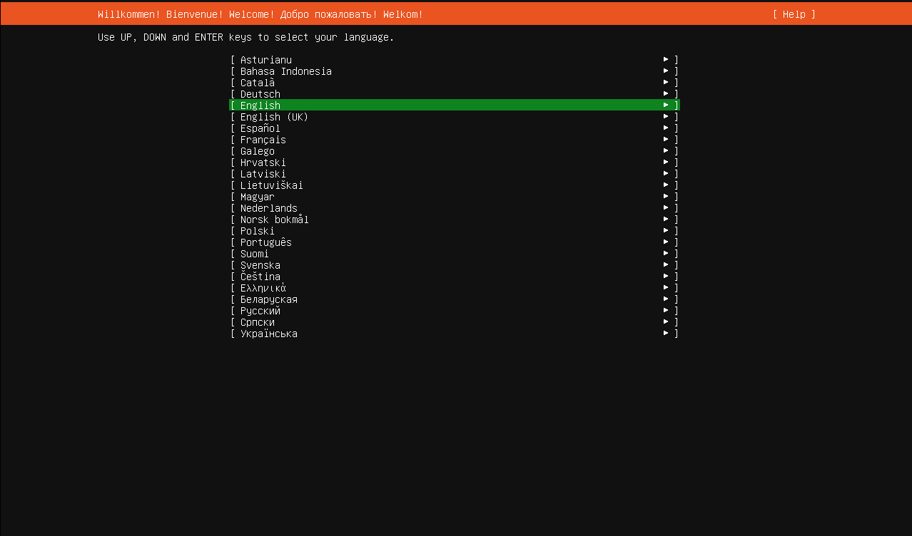

<<<<<<< HEAD
# TASK: 
1. Perbedaan antara IP Private & Public, serta IP Dynamic & Static!
   - IP Privat adalah  alamat IP yang digunakan di dalam jaringan lokal, contohnya localhost:
   - Ip Public adalah IP digunakan oleh setiap perangkat untuk terhubung ke internet, sehingga terhubung ke internet secara keseluruhan 
   - Ip Dynamic itu adalah dimana alamat IPnya itu berubah ubah ketika terhubung ke jaringan lain
   - Ip Static adalah dimana alamat Ipnya itu di tetapkan secara manual 
2. Buat penjelasan singkat tentang Virtualization!
   Virtualisasi adalah teknologi yang dapat Anda gunakan untuk membuat representasi virtual dari server, penyimpanan, jaringan, dan mesin fisik lainnya

=======
# Week 1 Tasks

## Task :
1. Perbedaan antara IP Private & Public, serta IP Dynamic & Static!
2. Buat penjelasan singkat tentang Virtualization!
>>>>>>> 43d2dc4b491711d121b477a0679a3ba91551af8e
3. Buat rancangan sebuah jaringan dengan spesifikasi sebagai berikut!
      - CIDR Block : 192.168.1.xxx/24
      - Subnet : 255.255.255.0
      - Gateway : 192.168.1.1
<<<<<<< HEAD
   (Gunakan app.diagrams.net untuk membuat diagramnya, Referensi gambar sudah disertakan)
   
6. Buat step-by-step untuk menginstall Virutal Machine via VMware, Virtualbox atau VM pilihan kalian!
   1) Klik Create new virtual machine dan pilih
      
   2) masukan file ubuntu yang telah di download
      
   3) masukan username dan password sesuai keinginan
      
   4) pilih lokasi penyimpanan
      
   5) pilih storage sesuai keinginan
      
   6) kemudian pilih customize
       
   7) pilih memory yang diinginkan
       
   8) kemudian pilih Nework Adapter, klik “Connect at power” dan juga “Bridged”
       
   9) kemudian akan berubah seperti ini dan klik finish jika sudah berubah
       
   10) pilih bahasa yang diinginkan
       
   11) pilih “Custome storage layout” untuk mengatur storage yang ingin kita gunakan kemudian klik “done”
       
   12) atur memori dan swap yang diinginkan disini saya memilih partisi 8G dan “swap” yaitu sebagai ram tambahannya “1G”
       
   13) akan muncul tampilan notifikasi seperti ini yang artinya ketika kita sudah selesai melakukan setup ketika klik “continue” tidak akan bisa kembali lagi
       
   14) isi setup sesuai keinginan
       
   15) pilih “install open ssh” kemudian langsung ke “done”
       
   16) Tunggu sampai install selesai, setelah itu akan muncul “Reboot now” kemudian klik
       
   17) Langkah terakhir kita coba ping 8.8.8.8 maka akan menghasilkan berikut
       

<<<<<<< HEAD
=======
>>>>>>> task
=======
(Gunakan app.diagrams.net untuk membuat diagramnya, Referensi gambar sudah disertakan)
4. Buat step-by-step untuk menginstall Virutal Machine via VMware, Virtualbox atau VM pilihan kalian!
>>>>>>> 43d2dc4b491711d121b477a0679a3ba91551af8e
=======
>>>>>>> 4fda518a046e53a4a7868cc07909104baedda780
