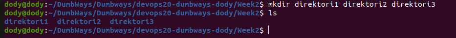
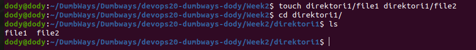
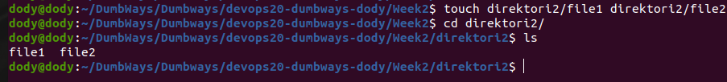
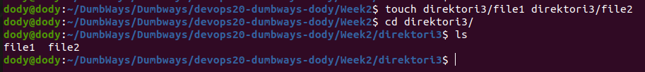
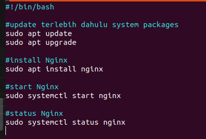
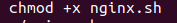
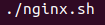
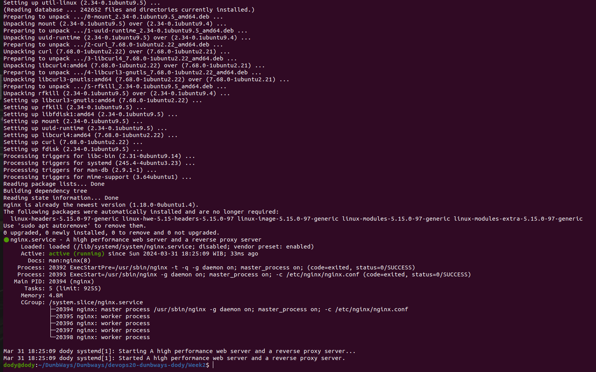

# Task:
1. Buat 3 directory yang masing-masing berisi 2 file dan rapihkan sebaik mungkin!
   ```
   mkdir direktori1 direktori2 direktori3
   ```
   

   membuat file masing-masing direktori
   - direktori 1
     
     ```
     touch direktori1/file1 direktori1/file2
     ```
   
     

   - direkotori 2
     ```
     touch direktori1/file1 direktori1/file2
     ```

     
     
   - direktori 3
     ```
     touch direktori1/file1 direktori1/file2
     ```

     

   
2. Penjelasan text manipulation beserta step by step
   Manipulasi teks adalah proses memodifikasi atau memanipulasi teks sesuai kebutuhan tertentu.
   Step by stepnya adalah:
    • Identifikasi Tujuan: Tentukan apa yang ingin Anda lakukan dengan teks tersebut. Apakah Anda ingin mengganti beberapa kata, memisahkan teks menjadi bagian-bagian yang berbeda, atau melakukan sesuatu yang lain?
    • Pilih Metode: Pilih metode atau alat yang tepat untuk melakukan manipulasi teks tersebut. Ini bisa berupa penggunaan perintah di terminal, penggunaan editor teks, atau bahkan penulisan skrip khusus.
    • Terapkan Perubahan: Gunakan metode yang Anda pilih untuk menerapkan perubahan pada teks. 
    • Uji Coba dan Koreksi: Setelah melakukan manipulasi, uji coba teks tersebut untuk memastikan bahwa perubahan yang Anda inginkan sudah terjadi. Jika perlu, koreksi atau modifikasi kembali hingga mencapai hasil yang diinginkan.
3. Penjelasan tool htop atau nmon
   * htop adalah buah utilitas interaktif yang digunakan untuk memonitor sistem dalam lingkungan Unix. Ini memberikan tampilan yang lebih baik dan lebih mudah dimengerti dari proses yang berjalan pada sistem.
   * nmon adalah alat monitor kinerja sistem yang digunakan pada sistem Unix dan Linux. Ini memberikan tampilan yang sangat rinci tentang penggunaan sumber daya sistem seperti CPU, memori, disk, dan jaringan.
4. buatlah BASH Script untuk instalasi nginx
   1) Buat terlebih dahulu file sh nya
      ```
      vim nginx.sh
      ```
   3) kemudian isi dengan script berikut
      
      
      
   5) beri ijin untuk eksekusi file dengan perintah berikut
      ```
      chmod +x nginx.sh

      
      
   7) kemudian jalankan script dengan perintah berikut
      ./nginx.sh
      
      
      
   9) hasilnya adalah berikut

      
