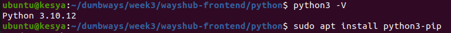
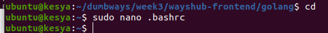

# TASK1:
1. Perbandingan antara Monolith & Microservices
   Monolitik merupakan sebuah pendekatan tradisional dalam pembangunan sebuah aplikasi. Aplikasi monolitik terbentuk sebagai satu kesatuan kode yang tidak dapat dipisahkan satu dan lainnya.  Salah     satu karakter sistem arsitektur monolitik adalah saat pemrogram ingin melakukan perubahan pada sistem monolitik, pemrogram harus mengubah satu kesatuan kode secara menyeluruh dan bersamaan
   microservices adalah sebaliknya. Microservices terbagi menjadi unit pecahan yang lebih kecil dan spesifik. Setiap unitnya terpisah dan memiliki sistem beserta database sendiri untuk beroperasi      dan menggunakan mekanisme API untuk terhubung dengan unit lainnya.
2. Deploy Aplikasi wayshub-frontend (NodeJS)
   * Pertama-tama kita harus meng-install terlebih engine-nya dahulu. Untuk instalasi kalian bisa menggunakan beberapa perintah dibawah ini.
     ```
     git clone https://github.com/dumbwaysdev/wayshub-frontend.git
     ```
   * Masuk ke direktori wayshub-frontend
     ```
     cd wayshub-frontend
     ```
   * kemudian menginstall npm
     ```
     npm install
     ```
   * kemudian kita start npm
     ```
     npm start
     ```
     
   * Kemudian kita testing di browser
     
     
3. Deploy Golang & Python dengan menampilkan nama masing-masing
   1) kita harus meng-install terlebih engine-nya dahulu. Untuk instalasi kalian bisa menggunakan beberapa perintah dibawah ini.
      ```
      curl -o- https://raw.githubusercontent..com/nvm-sh/nvm/v0.38.0/install.sh | bash
      ```
   2) kemudian selanjutnya
      ```
      source ~/.bashrc
      ```
      kemudian untuk mengecek apakah sudah terinstall atau belum
      ```
      nvm -v
      ```
      
   3) install nvm
      ```
      nvm install 16
      ```
   4) Jika tahapan di atas sudah kalian lakukan, maka kalian sudah berhasil untuk melakukan instalasi node.js. Untuk melakukan pengecekan kalian bisa menggunakan perintah di bawah ini.
      ```
      node -v
      ```
      ```
      npm -v
      ```
#### nodejs
   1) Buat direktori nodejs dan masuk kedalam direktori nodejs yang sudah dibuat
      ```
      mkdir nodejs
      ```
      ```
      cd nodejs
      ```
   2) ketik command berikut untuk menjalankan aplikasi
      ```
      npm init
      ```
      
   3) Selanjutnya kita akan menginstall Express JS. Express JS adalah framework dari NodeJS yang dirancang secara fleksibel dan sederhana
      ```
      npm install express --save
      ```
      
   4) membuat file baru
      ```
      sudo nano index.js
      ```
      
   5) kemudian kita jalankan
      ```
      node index.js
      ```
      
   6) terakhir test di browser
      


#### Pyton
   1) cek terlebih dahulu python apakah sudah terinstall dan juga pip
      ```
      python3 -v
      ```
      ```
      sudo apt install python3-pip
      ```
      
   2) install flask, flask sama dengan dengan express dari node yaitu tool untuk menjalankan aplikasi yang akan memberi kita akses untuk menaruh aplikasi kita didalam python yang akan menggunakan sebuah framework
      ```
      pip install flask
      ```
   3) kemudian membuat file python
      ```
      nano index.py
      ```
      
   4) jalankan file python yang sudah dibuatkan
      ```
      python3 index.py
      ```
      
   5) testing di browser
      
      
      

#### Golang
   1) Pertama-tama direktori golang dan masuk kedalam direktori golang yang sudah dibuat.
      ```
      mkdir golang
      ```
      ```
      cd golang
      ```
   2) download engine terlebih dahulu
      ```
      wget https://golang.org/dl/go1.16.5.linux-amd64.tar.gz && sudo su
      ```
   3) Selanjutnya masukkan path go pada .bashrc
      
   4) cek atau untuk bisa menjalankan golang
      ```
      exec bash
      ```
      kemudian masuk kedalam file bashrc
      ```
      sudo nano .bashrc
      ```
      kemudian tambahkan potongan file berikut
      
   5) kemudian kita membuat file golang di dalam direktori yang sudah kita buatkan
      ```
      nano index.go
      ```
      isi file sebagai berikut
      
   6) jalankan file yang sudah kita sebagai berikut
      


# TASK2:
1. Jelaskan apa itu Web server dan gambarkan bagaimana cara webserver bekerja.

   **Web server** adalah serangkaian perangkat keras (hardware) dan perangkat lunak (software) di dalam sebuah server.Dari sisi software, yang berfungsi sebagai medium untuk menerima permintaan       berupa halaman web dalam protokol HTTP atau HTTPS. Setelah menerima permintaan, web server akan memuat dan mengirim halaman yang diminta untuk disajikan di browser pengguna, misalnya Google        Chrome, Mozilla Firefox, Safari, dan sebagainya. Sementara dari sisi hardware, web server terhubung ke internet untuk bertukar informasi (data atau file) di antara perangkat lain yang saling       terhubung. Data yang dimaksud bisa berupa file HTML, gambar, file JavaScript, atau stylesheet CSS. Perangkat keras web server juga berfungsi untuk menyimpan software web server.

   CARA KERJANYA ITU
   * User memasukkan permintaan lewat browser
   * Browser mendapat alamat IP domain dan mencarinya ke DNS server
   * Browser meminta data yang dibutuhkan melalui HTTP/HTTPS
   * Web server mencari data yang diminta browser dalam hosting
   * Browser kemudian terhubung ke web server dan mengirimkan request file web yang diminta melalui HTTP
   * Web server menerima request dan meresponnya dengan mengirimkan file web yang diminta melalui protokol HTTP. Namun jika data tidak ketemu, web server akan mengirimkan halaman error
   * Browser menampilkan informasi kepada user
     
3. Buatlah Reverse Proxy untuk aplilkasi yang sudah kalian deploy kemarin. (wayshub), untuk domain nya sesuaikan nama masing" ex: alvin.xyz .
4. Jelaskan apa itu load balance.
   Load balancing adalah sebuah solusi yang dapat Anda terapkan untuk menstabilkan server. Load balancing merupakan proses pendistribusian traffic atau lalu lintas jaringan secara efisien ke dalam    sekelompok server, atau yang lebih dikenal dengan server pool atau server farm. Load balancing ini berguna agar salah satu server dari website yang mendapatkan banyak lalu linta kunjungan tidak    mengalami kelebihan beban. ketika salah satu server mati server yang lain bisa menghandlenya
5. implementasikan loadbalancing kepada aplikasi wayshub yang telah kalian gunakan.
   1) buatkan 2 mesin atau lebih
   2) siapkan kedua mesin dengan kebutuhan yang diinginkan seperti clone github, intall nvm, node, dan npm
   3) jalankan kedua mesin dengan menggunakan
      ```
      npm start
      ```
      ###### mesin1
      ###### mesin1
